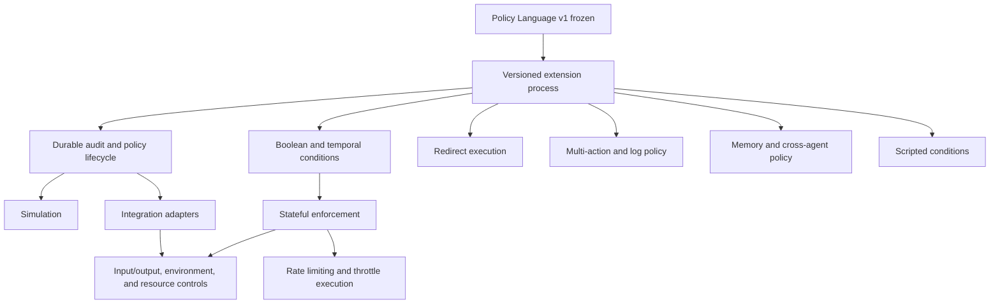

# Hardpoint Guardian Deferred Capabilities Roadmap

## Purpose

This roadmap turns the deferred items in `spec/hp-guard.md` into independently
approvable implementation plans. It does not authorize changes to Policy
Language v1. Each policy-language change requires a versioned specification,
shared conformance cases, and explicit approval before implementation.

## Delivery Principles

- Preserve the v1 parser and behavior as a compatibility baseline.
- Give each new semantic construct an explicit version and rejection behavior.
- Implement the same approved semantics in Python and Rust; neither runtime is
  the reference implementation.
- Introduce side effects only behind a narrow adapter contract. A decision to
  `redirect`, `throttle`, or request approval is not authority to perform that
  side effect without an approved executor.
- Record a policy identity with every durable decision before relying on a
  feature for audit or enforcement.

## Dependency Map

## Plan 1: Versioned Policy Extension Process

**Outcome:** v1 remains stable while a later policy version can introduce a
single new construct without ambiguous fallback behavior.

**Dependencies:** None.

### Tasks

1. Write a versioning specification that defines supported-version selection,
   incompatible-field errors, migration rules, and the compatibility promise
   for stored policies and audits.
2. Define a shared fixture schema that can assert parsing, decisions, audit
   fields, and effect requests without treating either runtime as canonical.
3. Add a test-only v2 dispatch boundary in both runtimes; retain v1 parsing
   unchanged and reject unapproved versions.
4. Document the feature-admission checklist: specification, fixtures,
   language-local regressions, security review, and release notes.

### Acceptance Criteria

- A v1 policy produces the same decision and error code as it does today.
- A future-version policy is rejected until its version is explicitly enabled.
- A new construct cannot be accepted in only one runtime.

### Verification

- Existing `make check` remains green.
- Shared cases prove v1 compatibility and unsupported-version rejection in both
  runtimes.

### Open Questions

- Is the next version a single v2 release or a capability-negotiated profile?
- How long must deprecated policy versions remain supported?

## Plan 2: Durable Audit, Policy Identity, and Safe Policy Lifecycle

**Outcome:** every decision can be correlated with an immutable policy
identity, and policy changes are recorded without affecting in-flight calls.

**Dependencies:** Plan 1.

### Tasks

1. Specify an append-only audit envelope with a policy version, policy digest,
   rule identifiers, decision, effect status, and redaction requirements.
2. Define a storage adapter with explicit durability, rotation, retention, and
   failure behavior; start with a local append-only implementation rather than
   a database dependency.
3. Add policy-loader snapshots: validate a new policy fully, atomically replace
   the active snapshot, and retain the snapshot used by every active call.
4. Add audit events for policy load, rejection, activation, retirement, and
   write failure. Do not log secrets or unbounded arguments by default.

### Acceptance Criteria

- A serialized audit record identifies the exact policy snapshot that decided
  the call.
- A failed reload leaves the previous valid snapshot active.
- Audit storage failure has an explicitly configured fail-open or fail-closed
  result; it is never silently ignored.

### Verification

- Deterministic tests cover concurrent read/reload boundaries, record
  serialization, redaction, rotation, and injected storage failures.
- Python and Rust produce equivalent audit-envelope fixtures.

### Open Questions

- What retention period and encryption-at-rest requirements apply?
- Should policy activation require a signed artifact?

## Plan 3: Policy Simulator and Trace Format

**Outcome:** an operator can evaluate a policy against recorded calls without
executing tools or mutating runtime state.

**Dependencies:** Plans 1 and 2.

### Tasks

1. Specify a versioned trace format containing normalized call input, policy
   identity, ordering, and optional expected historical decision; exclude raw
   tool output unless explicitly requested.
2. Build a pure simulator API that accepts a policy snapshot and trace,
   produces one decision per event, and returns a structured comparison report.
3. Define state handling: the initial release either prohibits stateful policy
   simulation or requires an explicit deterministic state seed.
4. Add a command-line entry point that reads trace files and emits JSON or a
   tabular report without invoking an execution adapter.

### Acceptance Criteria

- Simulation never invokes a tool, script, redirect target, approval handler,
  or persistent rate-limit store.
- Replaying a trace with a v1 policy gives the engine's decision and matched
  rules for every event.
- Malformed or incompatible trace input returns stable errors.

### Verification

- Shared trace fixtures cover allows, denies, malformed events, and policy
  comparison output in both runtimes.
- An integration test proves that a deliberately side-effecting adapter is not
  called during simulation.

### Open Questions

- Should the first CLI support only JSON Lines, or JSON arrays as well?
- What comparison summary is required for a policy-change review?

## Plan 4: Proxy, Sidecar, and Inline Integration Adapters

**Outcome:** the engine can be embedded or deployed at a boundary where the
agent cannot bypass the approved enforcement path by accident.

**Dependencies:** Plans 1 and 2.

### Tasks

1. Specify one runtime-neutral enforcement request and response envelope,
   including caller identity, tool identity, arguments, context, correlation
   ID, deadlines, and a non-bypassable decision field.
2. Implement an inline adapter as the reference integration shape; it evaluates
   a snapshot, writes an audit event, and returns an effect request only.
3. Implement a sidecar transport with authenticated local communication,
   timeouts, retry rules, and explicit behavior when the sidecar is unavailable.
4. Implement a proxy adapter only for a named protocol and tool boundary; it
   must not become a transparent general-purpose gateway.
5. Add adapter conformance tests that run the same request fixtures through all
   supported modes.

### Acceptance Criteria

- All adapters preserve the policy decision, matched rules, correlation ID,
  and policy identity.
- Adapter failure behavior is configured and tested for each mode.
- The proxy only protects traffic that actually traverses it; documentation
  states this boundary precisely.

### Verification

- Contract tests cover timeout, unavailable sidecar, duplicate request,
  unauthorized caller, and bypass-attempt behavior.
- A live local smoke test exists for every supported adapter mode.

### Open Questions

- Which agent protocols and tool schemas are in scope for the first proxy?
- Is a remote sidecar ever permitted, or must it remain host-local?

## Plan 5: Boolean and Temporal Condition Language

**Outcome:** policies can express approved combinations of conditions and time
windows without relying on host-language expression evaluation.

**Dependencies:** Plan 1.

### Tasks

1. Specify a small condition AST for `all`, `any`, and `not`, including empty
   operands, nesting limits, error codes, and declaration-order semantics.
2. Specify temporal conditions with an explicit timezone, clock source,
   interval-boundary rule, and test-injected clock. Do not use locale defaults.
3. Extend parsers and evaluators in both runtimes from shared fixtures first.
4. Bound evaluation depth and input size to prevent policy-controlled resource
   exhaustion.

### Acceptance Criteria

- Equivalent nested conditions return equal decisions in both runtimes.
- Invalid ASTs, unknown operators, timezone omissions, and excessive depth are
  rejected with stable errors.
- Time-window behavior is deterministic under an injected clock.

### Verification

- Shared fixtures cover truth tables, nesting, boundary timestamps, daylight
  saving transitions where supported, and malformed conditions.
- Property tests verify De Morgan cases and bounded recursion.

### Open Questions

- Are recurring schedules required, or only absolute intervals in the first
  release?

## Plan 6: Stateful Enforcement, Rate Limits, and Throttle Execution

**Outcome:** policies can make bounded stateful decisions and enforce rate
limits without changing the meaning of existing stateless policies.

**Dependencies:** Plans 1, 2, and 5.

### Tasks

1. Specify the state key, lifecycle, consistency guarantees, retention, and
   behavior on unavailable state storage. Include nested call depth and
   recursion counters in this model rather than adding ad hoc globals.
2. Define the rate-limit grammar and algorithms, beginning with one fixed or
   sliding-window algorithm and explicit monotonic-time behavior.
3. Add a state-store interface with deterministic in-memory and durable
   implementations; require atomic check-and-consume operations.
4. Define throttle as a requested effect with a deadline and cancellation
   behavior, then implement it only in adapters that can honor that contract.
5. Add rate-threshold and state-match conditions after the state model is
   proven.

### Acceptance Criteria

- Concurrent calls cannot consume more quota than the configured limit.
- Storage failure, clock rollback, and a cancelled throttle have documented and
  tested outcomes.
- Stateless v1 evaluation requires no state-store access.

### Verification

- Deterministic concurrency tests, virtual-clock tests, and adapter tests
  cover quota boundaries, nested calls, recursion limits, and restart recovery.
- Benchmark the supported key cardinality and enforcement latency before
  declaring production readiness.

### Open Questions

- Which identities form the first rate-limit key: agent, user, tool, or all
  three?
- Is distributed state required, or is host-local enforcement sufficient?

## Plan 7: Redirect Execution

**Outcome:** an approved redirect can safely invoke a declared alternate tool
without becoming arbitrary tool dispatch.

**Dependencies:** Plans 1, 2, and 4.

### Tasks

1. Specify a redirect action schema with an allowlisted destination, argument
   mapping, maximum redirect depth, audit fields, and a prohibition on dynamic
   destination names.
2. Extend resolution to return a typed redirect request; do not execute it in
   the core engine.
3. Add adapter-level execution that re-evaluates the redirected call, retains
   the original correlation ID, and blocks cycles and policy bypasses.
4. Record requested, attempted, completed, failed, and blocked redirect events.

### Acceptance Criteria

- A policy cannot redirect to an undeclared or caller-supplied destination.
- Redirected calls obey the destination policy and depth limit.
- Cycles, malformed mappings, and unavailable destinations fail deterministically.

### Verification

- Shared fixtures cover request formation; adapter tests cover loops, nested
  redirects, and policy re-evaluation.
- A negative test proves that a redirect cannot escape the tool allowlist.

### Open Questions

- Does the first version permit argument transformation, or only an identity
  mapping?

## Plan 8: Multi-action Rules and Logging Policy

**Outcome:** a policy can request an enforcement decision and compatible
observability effects without weakening deny precedence or duplicating audits.

**Dependencies:** Plans 1 and 2.

### Tasks

1. Specify a result model that separates one terminal enforcement decision
   from zero or more ordered effect requests such as `log` and
   `require_approval` notifications.
2. Define conflict rules, idempotency keys, duplicate suppression, and whether
   global `log_all` applies to denied or malformed requests.
3. Update precedence and matching fixtures so terminal-decision selection is
   independent from effect aggregation.
4. Add adapter support for the approved effect types with retries only where
   idempotency is guaranteed.

### Acceptance Criteria

- Adding `log` cannot convert a deny into an allow.
- Every requested effect has a deterministic order and correlation ID.
- Duplicate delivery is observable and does not duplicate a terminal action.

### Verification

- Shared fixtures cover terminal-action conflicts and effect ordering.
- Adapter tests cover duplicate delivery and one failed non-terminal effect.

### Open Questions

- Is human approval a terminal pending result or an external effect that later
  resumes evaluation?

## Plan 9: Memory Policy and Cross-agent State

**Outcome:** policies restrict memory reads and writes by explicit ownership,
purpose, and sharing rules rather than treating memory as an unscoped tool.

**Dependencies:** Plans 1, 2, and 4; Plan 6 if access depends on prior state.

### Tasks

1. Specify memory resource identifiers, owner and tenant boundaries, operation
   types, declared scopes, and the default-deny rule for unknown memory.
2. Define how policy receives provenance and whether an agent may delegate
   access; do not infer ownership from a free-form memory name.
3. Add memory operation targets and decisions to the shared policy contract.
4. Implement an adapter boundary that authorizes before reading or writing and
   records the resource identifier, not the raw memory content, by default.
5. Add tests for cross-agent access, shared scope, revocation, and stale
   provenance.

### Acceptance Criteria

- A caller cannot access another agent's memory without a matching explicit
  rule.
- The engine evaluates stable identifiers and provenance, not memory contents.
- Revocation takes effect for new operations without corrupting old audits.

### Verification

- Shared fixtures cover own, shared, denied, delegated, and unknown scopes.
- Integration tests prove authorization occurs before adapter I/O.

### Open Questions

- Is memory ownership tied to an agent, a user, a project, or a tenant?
- Are read and write authorizations independently configurable in the first
  release?

## Plan 10: Scripted Conditions

**Outcome:** an explicitly enabled extension can evaluate context-aware logic
within a bounded sandbox, while declarative policy remains the default.

**Dependencies:** Plans 1, 2, and 4.

### Tasks

1. Specify the scripting threat model, supported language, inputs, outputs,
   deterministic API surface, resource limits, and failure behavior.
2. Choose an isolated execution mechanism only after evaluating portability,
   startup cost, sandbox strength, and maintenance burden for both host
   runtimes.
3. Define a script artifact identity and approval workflow; policy text must
   reference immutable approved artifacts rather than arbitrary source paths.
4. Implement a bounded evaluator behind an adapter and audit every invocation,
   timeout, rejection, and result.

### Acceptance Criteria

- A script cannot access the host filesystem, network, process environment,
  secrets, or unbounded CPU and memory unless a later policy explicitly grants
  a capability.
- Script failure has deterministic policy semantics and an audit record.
- A declarative policy does not load a scripting runtime.

### Verification

- Security tests cover attempted host access, timeouts, memory limits, invalid
  outputs, and repeated invocation.
- Cross-runtime fixtures compare the policy-facing script result, not the
  implementation language.

### Open Questions

- Is a shared portable expression language sufficient before embedding Python
  or JavaScript?

## Plan 11: Model I/O, Environment, Resource, and Token-level Controls

**Outcome:** enforcement expands beyond tool calls through explicit event
boundaries, with clear limits on what hp-guard can and cannot sandbox.

**Dependencies:** Plans 1, 4, and 6. Plan 10 is optional for scripted resource
decisions.

### Tasks

1. Specify event types for model input, model output, environment access, file
   access, network access, and resource consumption. Define which metadata is
   visible to policy and which content is redacted or sampled.
2. Implement one event type at a time, beginning with an adapter-level
   environment or resource request rather than claiming full sandboxing.
3. Define quotas for tokens, bytes, calls, wall-clock time, and nesting depth,
   each backed by the state model where required.
4. For token-level controls, specify tokenizer identity, streaming behavior,
   partial-output handling, and the impossibility of retroactively preventing
   already-emitted tokens.
5. Add performance tests that measure the enforcement overhead for each event
   type and reject unbounded policy-controlled input.

### Acceptance Criteria

- Every supported event has a documented trust boundary and a precise failure
  mode.
- Resource accounting is attributable to a policy identity and correlation ID.
- Documentation does not claim filesystem isolation, network isolation, or
  token-level prevention beyond what the selected adapter enforces.

### Verification

- Event conformance fixtures and integration tests cover allow, deny, timeout,
  oversized input, streaming output, and unavailable accounting storage.
- Performance gates set and verify a latency budget for each supported event.

### Open Questions

- Which single event type has the highest near-term value?
- Is token counting advisory, a hard quota, or both?

## Recommended Implementation Order

1. Plan 1: versioned extension process.
2. Plan 2: durable audit and policy lifecycle.
3. Plan 3: simulator.
4. Plan 4: one inline integration adapter, then sidecar or proxy only when a
   concrete target protocol exists.
5. Plan 5: boolean and temporal conditions.
6. Plan 6: stateful enforcement and rate limits.
7. Plan 7 or Plan 8, based on the first required external effect.
8. Plan 9, Plan 10, and Plan 11 only when their ownership, sandbox, and event
   boundaries have an approved product requirement.

## Approval Gates

Before beginning any plan, create a focused specification, implementation plan,
and task list for that slice. Obtain approval before adding a dependency,
introducing a stateful feature, defining a v2 construct, selecting a scripting
runtime, or widening the enforcement boundary.
