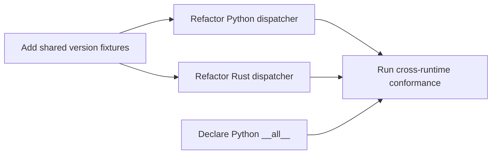

# Implementation Plan: Versioned Policy Extension Process

## Overview

Implement the approved version-dispatch boundary without changing Policy
Language v1 behavior. The slice also makes the Python package exports explicit
so that its public API does not depend on four `# noqa: F401` comments.

This plan does not make `version: 2` valid. It makes the future rejection path
explicit and proves that v1 remains stable.

## Architecture Decisions

- Parse YAML once at the public boundary, inspect the declared version, then
  route the parsed document to a version-specific parser.
- Keep the v1 parser private to each runtime. The public `PolicyParser::parse`
  and `PolicyParser.parse` interfaces remain unchanged.
- Continue returning `unsupported_version` for missing, non-integer, and
  unsupported versions. There is no fallback to v1.
- Use one shared fixture file for both runtimes. Any future v2 parser is added
  only after a separately approved v2 contract and fixtures exist.
- Declare Python re-exports using `__all__`; this documents the public surface
  and replaces lint suppressions without changing import behavior.

## Dependency Order



## Phase 1: Shared Contract Coverage

Add conformance cases before changing either parser:

- missing `version` returns `unsupported_version`;
- non-integer `version` returns `unsupported_version`;
- `version: 2` returns `unsupported_version`;
- a v2-only field in a v1 policy returns `invalid_field`.

The existing v1 fixture cases remain unchanged. This establishes the external
behavior that both refactors must preserve.

**Checkpoint:** both existing runtimes fail the new fixture only if current
behavior differs; record the baseline before refactoring.

## Phase 2: Version Dispatch in Both Runtimes

In Python, separate YAML loading and version selection from the current v1
field parser. In Rust, split the current `PolicyParser::parse` body into a
version-selection boundary and a v1-document parser. Each dispatcher must use
the already-parsed document and must preserve v1 ordering and error codes.

Do not add a v2 parser, feature flag, or migration path.

**Checkpoint:** all shared fixtures, language-local parser tests, and the full
test suite pass in both runtimes.

## Phase 3: Explicit Python Package Exports

Replace the four `# noqa: F401` comments in `src/hp_guard/__init__.py` with an
explicit `__all__` list containing the same exported names. Add a focused test
that imports the public names from `hp_guard` and confirms their identity.

**Checkpoint:** the public import path remains valid and the package module
contains no `# noqa` directive.

## Files Expected to Change

- `conformance/cases/v1_core.json`
- `src/hp_guard/parser.py`
- `src/parser.rs`
- `src/hp_guard/__init__.py`
- Python and Rust parser or conformance tests
- a small Python public-API test

## Verification

```bash
make check
git diff --check
```

The review must also confirm that `version: 1` decisions and matched-rule order
remain identical for every existing shared fixture.

## Risks and Mitigations

| Risk | Mitigation |
| --- | --- |
| Dispatch refactor changes a v1 error code | Add the version cases to shared fixtures first and preserve existing cases unchanged. |
| One runtime accidentally accepts v2 | Both runners execute the same `version: 2` rejection fixture. |
| YAML is parsed twice or differently by the dispatcher | Pass the parsed document to the selected version parser. |
| Public Python imports break during cleanup | Test every exported name through `hp_guard`. |

## Not in This Plan

- A v2 grammar or evaluator.
- Durable audit storage, policy reload, adapters, state, or effects.
- New dependencies or a Python linting tool.
