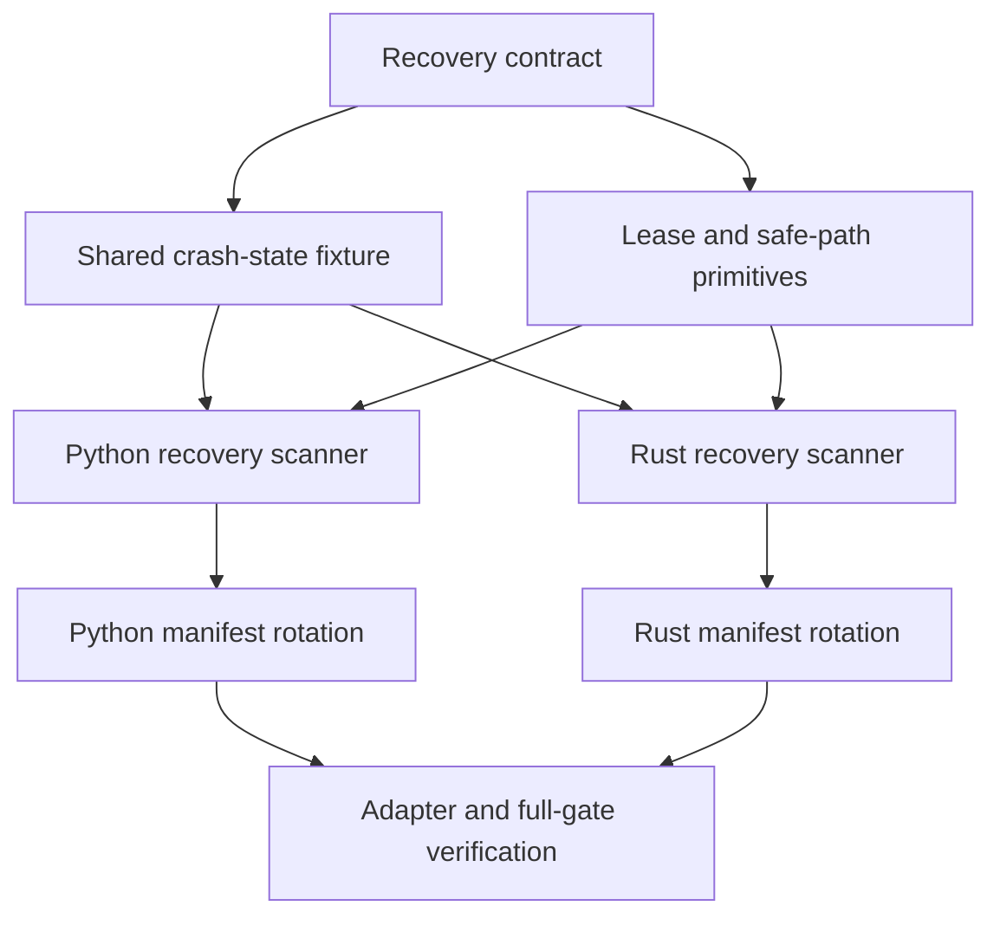

# Implementation Plan: Durable Local Audit-Log Recovery

## Overview

Strengthen the existing local `AuditLog` behind its current public role. The
new layer acquires a cross-process Unix lease, validates/recover the managed
JSONL prefix, and completes any manifest-backed rotation before policy
activation or authorization can return. The adapter remains a consumer of the
same fail-closed audit boundary.

The normative source is
[Durable Local Audit-Log Recovery](../spec/2026-08-11-durable-log-recovery.md).

## Architecture Decisions

- Keep `AuditLog` and `AuditedPolicyStore` as the public integration surface.
  Add explicit close semantics rather than a second competing logging API.
- Target Unix recovery first. Required OS primitives are `flock`, no-follow
  file opens, owner-only modes, and file/directory syncing; missing primitives
  fail closed rather than silently degrade.
- Acquire and retain one sidecar lock (`.lock`) for the log lifetime. Python
  and Rust use the same advisory-lock primitive and file naming so they contend
  across runtimes.
- Recover only an invalid, unterminated suffix after an otherwise valid JSONL
  prefix. All other malformed states remain evidence-integrity failures.
- Make rotation transactional with a synced manifest and deterministic staging
  names. Recovery always completes a declared transaction; it never guesses
  or overwrites unknown files.

## Dependency Graph

## Slices

1. Define the shared crash-state fixture schema and materialization helpers;
   add runners before changing production behavior.
2. Add Unix lease, regular-file, and directory-sync primitives in Python and
   Rust. Reassert existing audit behavior under an acquired lease.
3. Implement prefix validation and torn-tail recovery independently in Python
   and Rust against the shared cases.
4. Implement manifest creation, staging, completion recovery, and retention
   pruning independently in Python and Rust against the same cases.
5. Wire close/error behavior through stores/adapters, update public docs, run a
   fresh security review, and execute the full release gate.

## Risks and Mitigations

| Risk | Impact | Mitigation |
|---|---|---|
| A lock is released or bypassed too early | Concurrent history corruption | Hold the lease for `AuditLog` lifetime; test process contention and cross-runtime naming. |
| Recovery erases valid evidence | High | Only truncate a non-JSON suffix after every prior line validates; reject all other ambiguity without mutation. |
| A crash leaves rotation files in an ambiguous layout | High | Sync manifest before rename, use deterministic staging names, and test recovery at every injected phase. |
| Unix calls differ between Python and Rust | High | Shared disk-layout fixture plus runtime-specific syscall-failure regressions. |
| Recovery scans grow unbounded | Medium | Document startup scan cost; rely on bounded rotation and make future scan/checkpoint optimization an explicit follow-up. |
| Public API change surprises hosts | Medium | Preserve current roles, add only `close()`, document new fail-closed errors, and keep adapter error mapping stable. |

## Verification Checkpoints

### After shared fixture and locking

- Focused Python and Rust lock/path tests pass.
- A second process cannot acquire the same path.
- Existing audit/adaptor behavior remains green.

### After tail recovery

- Both runtimes produce the same recovered layouts and error codes.
- Invalid interior data leaves every file byte-for-byte unchanged.

### After manifest rotation

- Every injected interruption phase converges to the expected retained sequence.
- The adapter emits no effect on any recovery failure.

### Complete

- `make check`
- `git diff --check`
- Fresh security review of lock, path, manifest, and recovery ordering.

## Parallelization

Once fixture naming and error codes are committed, Python and Rust recovery
implementations can proceed in parallel. Manifest semantics, fixture schema,
and public error names are shared-contract changes and must be settled
sequentially first.
